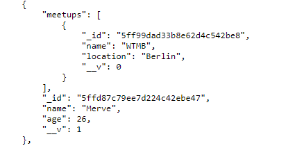

# WTMB-2019 5th LECTURE 

## Routes


Create routes file. We should transport our requests to this file. 
Like the example below


**Note**:<br>
Make sure that each file has required express and `module.exports=router`

## index.js


Because of transporting all requests are in routes folder. We should require all routes in index.js.
`const personRouter = require('./routes/person')`
`app.use('/person', personRouter)`

## MongoDB and Mongoose


MongoDB is a document database with the scalability and flexibility that you want with the querying and indexing that you need.

Mongoose provides a straight-forward, schema-based solution to model your application data.

Dowloand and run MongoDB. install mongoose `npm i mongoose`

Create a ```mongo-connection.js``` file and connect wtih mongoose `mongoose.connect('...')`. In index.js, `require('./mongo-connection')`

## Models Folder


Before mongoose, we have used person and meetup classes to define constructor and methods. With mongoose and mongoDB, we can use **Schema**

```
     module.exports = class Person {
     constructor(name, age, meetups = [], id) {
         this.name = name
         this.age = age
         this.meetups = meetups
         this.id = id
     }

```

```
const PersonSchema = new mongoose.Schema({
    name: String,
    age: Number
})
```

```
const PersonModel = mongoose.model('person', PersonSchema)
module.exports = PersonModel
```

## Services

In services folder, we have base-service, person-service and meetup-service.

If we update base-service's functions, we will be able to use them for services that we have.


For more information about [mongo](https://docs.mongodb.com/manual/reference/) and [mongoose](https://mongoosejs.com/docs/api.html)

Update meetup and person services like this:

**Note**:<br>
This property is avaliable for node -v 12 and above 
```
class PersonService extends BaseService {
    model= PersonModel
}
```
`model=PersonModel` means that
 ``` 
 constructor(model){
     this.model =PersonModel
 }
 ```

**Note**:
- *Base-service is a link that goes between the database and the routers*<br>
- *Dont use mongoose model directly in routes. Use services into routes*<br>
- Why would we want to have a base-service?<br>
- *Trying to modularize our code which means we should be able to plug and play different modules and they should still work.*<br>

**We dont want to depend on other people's choices**

If we need to change database in the future. All we need to do is replace:
- the models
- library
- the base-service (functions)

## Validation


For more [validation properties](https://mongoosejs.com/docs/validation.html#built-in-validators)

## Add Functionality

In first week, we had attend method that a person could attend to meetup. But, with mongoose, we had just name, age and location properties in our models.<br>

First **VISUALIZE**

`axios.post('/person/id of person/meetups', {meetup: 'id of meetup'})`

-Go to person route and create post request


-Then, we need to define attend function inside person model


Now we can attend meetup and see the id of meetup in meetups array.<br>

`axios.post('/person/5ffd87c79ee7d224c42ebe47/meetups', {meetup: '5ff99dad33b8e62d4c542be8'}).then(console.log)`


## AutoPopulate

After adding meetup id to person meetups array. We have to fetch data based on the id (meetup in this case) populate the remaning details

`npm i mongoose-autopopulate`
`PersonSchema.plugin(require('mongoose-autopopulate'))`
```
meetups: [{
        type: mongoose.SchemaTypes.ObjectId,
        ref: 'Meetup',
        autopopulate: true
    }]
```
-Look at the person meetups



-In attend function, we missed one part. If a person can attend the meetup, meetup should have a list of attendees.


**Note**:<br>
`meetup.attendees.push(this)` this push function is different than normal push function. Normally, we can use `push(this)` to push all data(object) what we have. In here we can push only id of this. So we have to autopopulate the remainig details. But, there is an issue with autopopulate.<br>

Mongo populate every single field. It causes looping. By default, we can see 10 populations, but 2 populations shold be enough. To fix this issue;

```
autopopulate:{
    maxDepth:1
}
```

## Cross Functional Problem

Models should never depend on each other. We shouldnt create method that dictates another models in models. <br>

We should carry `attend` function to `PersonService` like this:


**Note**: Dont forget the change in the person-route


Models can have methods that are only related to themselves. For example, finding person which is 18 years old or has college student etc.


**Note**:<br>
$gt is mongoDB operator
$gt means that greather than, $gte means that greather than equal to
